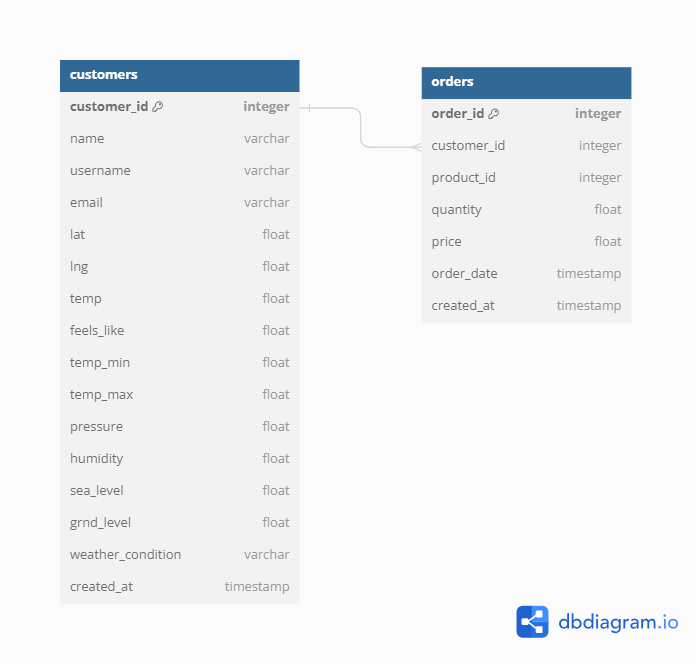

# Sales Data Pipeline
A comprehensive sales data pipeline for a retail company. The pipeline  should combine generated sales data with data from external sources, perform data  transformations and aggregations, and store the final dataset in a database. The aim is to enable  analysis and derive insights into customer behaviour and sales performance.

# How to use
## Using Python
1) Install python 3.6 from [here](https://www.python.org/downloads/release/python-360/)
2) Install git bash from [here](https://git-scm.com/downloads)
3) Open git bash in the folder that you want to clone this repo in and write the following:
    * `git clone https://github.com/marwanWaly/sales-data-pipeline.git`
    * `cd sales-data-pipeline`
    * `python -m venv venv`
    * Activate venv
      - For windows `. venv/Scripts/activate`
      - mac or linux `source venv/bin/activate`
    * `pip install -r requirements.txt`
4) Open `.env`and replace `Your-API-Key` with your API key
5) Return to git bash window and write `python src/main.py`
## Using Docker
1) Install Docker
2) open your terminal and write the following:
     * `docker pull marwan2599/sales-pipeline`
     * `docker run -e WEATHER_API_KEY=Your-API-Key marwan2599/sales-pipeline`

# Documentation
This repo contains multiple folders let's discuss them one by one:
## [data](data)
contains two folders:
1) [`input`](data/input) which has the [`Sales data.csv`](data/input/Sales%20data.csv) the input of this pipeline.
2) [`output`](data/output) empty but the pipeline will use it to save the output in it.
## [configs](configs)
contains two files:
1) [`configs.yaml`](configs/configs.yaml) which has all configurations that control the pipeline.
2) [`schema_creation.sql`](configs/schema_creation.sql) which has the needed SQL script that create the schema of the output DB.
## [exploration](exploration)
contains [explore.ipynb](exploration/explore.ipynb) a notebook that I used to explore and analyze the data
## [figures](figures)
contains all extracted figures during the analysis phase in [explore.ipynb](exploration/explore.ipynb)
 
</img>
</img>
</img>
</img>
</img>
</img>
</img>
## [src](src)
contains the source code of the project
1) [`main.py`](src/main.py) the main entry point tp the project
2) [`pipeline`](src/pipeline)
     1) [`pipeline.py`](src/pipeline/pipeline.py) contains `Pipeline` class
     2) [`extractor.py`](src/pipeline/extractor.py) contains helper functions for the extract process
     3) [`transformer.py`](src/pipeline/transformer.py) contains helper functions for the transform process
     4) [`loader.py`](src/pipeline/loader.py) contains helper functions for the load process

# Database schema

# Features
1) [`configs.yaml`](configs/configs.yaml) has been created to make the pipeline adjustable with other inputs and outputs types.
2) The pipeline will add only the new data in the database without craching with duplicated primary keys.
3) Missing data or not working APIs are handled.

# Future work
1) Add other types for inputs and outputs functionality in the code.
2) Add data validation layers after before each ETL processes.
3) Create a dashboard to read from the DB and shows the desired insights.

# Aggregations and Data Manipulation
1) `order-date` column's data type is converted to datetime.
2) `amount` is calculated using `price` and `quantity`
3) `month` is extracted from `order-date`
4) `quarter` is extracted from `order-date`
5) weather data is added for each customer in one data frame.
6) customers data frame is merged with sales data frame.

